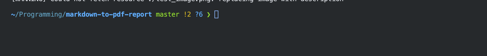

# Markdown to PDF Report

## Pandoc usage

### pre-requisite (brew)

-   pandoc
-   pandoc-crossref
-   mactex (if you installed basictex, you may need to remove it and install mactex)

### command

```bash {.numberLines startFrom="1"}
pandoc test.md -o output_file.pdf \
    --filter pandoc-crossref \
    --citeproc \
    --bibliography=bib.bib \
    --highlight-style=tango
```

-   `--filter pandoc-crossref` enables cross-referencing for figures, tables, and equations.
-   `--citeproc` enables citation processing for references. (only when use .bib file reference)
-   `--bibliography=bib_file.bib` specifies the bibliography file to use for references. (only when use .bib file reference)
-   `--highlight-style=tango` sets the syntax highlighting style for code blocks. You can choose from various styles like `pygments`, `kate`, `monochrome`, etc.

## Syntax of Markdown for Better Writing

### Definition

Term 1

: Definition
with lazy continuation.

    Paragraph for Term 1 definition.

    { some code, part of definition }

    - bullet 1
    - bullet 2

### Example

#### examples with (@)

(@) My first example will be numbered (1).
(@) My second example will be numbered (2).

Some text between examples.

(@) My third example will be numbered (3).

#### examples with (\@foo)

(@foo) My first example will be numbered (4).

As you can see, in the (@foo) examples, the numbering is continuous. You can also refer to them like this: (\@foo).

### list division

You can divide lists (reset ordering number and line spacing) by adding an empty line between them:

```markdown
1.  one
2.  two
3.  three

<!-- -->

1.  uno
2.  dos
3.  tres
```

upper list will be rendered as:

1.  one
2.  two
3.  three

<!-- -->

1.  uno
2.  dos
3.  tres

### Highlight

You can highlight text by

```markdown
[text to highlight]{.mark}
```

this is rendered as:

[text to highlight]{.mark}

### Small caps

You can use small caps by

```markdown
[small cap text]{.smallcaps}
```

this is rendered as:

[small cap text]{.smallcaps}

### Footnote

You can add a footnote like this:

```markdown
Here is a footnote reference,[^1] and another.[^longnote]

[^1]: Here is the footnote.
[^longnote]: Here's one with multiple blocks.

    Subsequent paragraphs are indented to show that they belong to the previous footnote.
```

this is rendered as:

Here is a footnote reference,[^1] and another.[^longnote]

[^1]: Here is the footnote.
[^longnote]: Here's one with multiple blocks.

    Subsequent paragraphs are indented to show that they belong to the previous footnote.

### Code formatting

You can put line number in the code:

````
```py {.numberLines startFrom="1"}
some code
```

````

this is rendered as:

```c {.numberLines startFrom="1"}
import numpy as np

def f(x):
    return x**2
```

you can also chane the color scheme of highlighting by pandoc option:

```bash {.numberLines startFrom="1"}
--highlight-style=tango
```

compatiable color schemes are:

-   pygments
-   kate
-   monochrome
-   espresso
-   zenburn
-   haddock
-   tango
-   breezedark
-   breezelight

### Image resizing

{width=80%}

```markdown
{width=80%}
```

You can resize the image by adding `{width=value}` after the image link. The value can be in percentage or in pixel.

Here’s a detailed explanation for each component of the metadata you’ve provided for your Pandoc markdown:

### reference using .bib file

You can add references using a `.bib` file. For example, you can add a reference like this:

```markdown
-   Some senetence that use reference 1. [@knuth1997art]
-   Some senetence that use reference 2. [@website]
```

`bib_file.bib` looks like this:

```bib {.numberLines startFrom="1"}
@book{knuth1997art,
  title={The Art of Computer Programming, Volume 1: Fundamental Algorithms},
  author={Knuth, Donald E.},
  year={1997},
  publisher={Addison-Wesley},
  edition={3rd},
  address={Boston},
}

@article{lamport1986document,
  title={Document preparation system: {L}a{T}e{X}},
  author={Lamport, Leslie},
  journal={Software: Practice and Experience},
  volume={16},
  number={6},
  pages={745--765},
  year={1986},
  publisher={Wiley Online Library}
}

@inproceedings{lecun1998gradient,
  title={Gradient-based learning applied to document recognition},
  author={LeCun, Yann and Bottou, L{\'e}on and Bengio, Yoshua and Haffner, Patrick},
  booktitle={Proceedings of the IEEE},
  volume={86},
  number={11},
  pages={2278--2324},
  year={1998},
  organization={IEEE}
}

@misc{website,
  author = {John Doe},
  title = {An Interesting Article},
  year = {2023},
  url = {http://www.example.com/article},
  note = {Accessed: 2024-10-10}
}
```

This will be rendered as:

-   Some senetence that use reference 1. [@knuth1997art]
-   Some senetence that use reference 2. [@website]

The references will be listed at the end of the document by using the following code block,
and only the references that are cited in the document will be displayed:

```markdown
:::{#refs}
:::
```

## Metadata for Pandoc Markdown (should be at the beginning of the markdown file)

Following is the metadata used in this document and its purpose:

```yml {.numberLines startFrom="1"}
---
title: Markdown Report Guide for Better Writing
date: \today
geometry: margin=1in
papersize: a4
fontfamily: newtxtext, newtxmath
numbersections: true
autoEqnLabels: true
header-includes: |
    \usepackage[fontsize=12pt]{scrextend}
    \usepackage{authblk}
    \author{Hyungjun Shon}
    \affil{Dept. of Systems Management Engineering\\Sungkyunkwan University}
    \usepackage{fancyhdr}
    \pagestyle{fancy}
    \fancyhead[L]{Markdown to PDF report}
    \fancyhead[C]{}
    \fancyhead[R]{\thepage}
    \fancyfoot{}
    \usepackage{float}
    \let\origfigure\figure
    \let\endorigfigure\endfigure
    \renewenvironment{figure}[1][2] {\expandafter\origfigure\expandafter[H]} {
      \endorigfigure
    }
#   \usepackage[hangul, nonfrench, finemath]{kotex}
abstract: |

    This is the test abstract of ducment. This is the test abstract of ducment. 
    This is the test abstract of ducment. This is the test abstract of ducment. 
    This is the test abstract of ducment. This is the test abstract of ducment. 
    This is the test abstract of ducment. This is the test abstract of ducment. 
    This is the test abstract of ducment. This is the test abstract of ducment.
---
```

### Title and Date

-   `title: Title of the Document` sets the document's title, which will appear at the top.
-   `date: \today` automatically inserts the current date when the document is compiled.

### Page Layout and Paper Size

-   `geometry: margin=1in` ensures that the margins are set to 1 inch all around.
-   `papersize: a4` specifies that the document will be printed on A4-sized paper.

### Font and Font Size

-   `fontfamily: newtxtext, newtxmath` (if uncommented) would apply the NewTX font for both text and math.
-   `fontsize: 10pt` sets the base font size to 10 points.

### Section Numbering and Equation Labels

-   `numbersections: true` enables automatic numbering for sections.
-   `autoEqnLabels: true` ensures that equations are automatically labeled for easy referencing.

### Font size

-   `\usepackage[fontsize=12pt]{scrextend}` sets the font size to 12 points.

### Custom Headers and Footers

-   `header-includes:` is a placeholder for any additional LaTeX packages or settings.
-   `\usepackage{authblk}` allows for author affiliation formatting.
-   The combination of `\pagestyle{fancy}`, `\fancyhead`, and `\fancyfoot` enables custom headers and footers. In your example:

    -   The left header (`\fancyhead[L]`) would display a course name.
    -   The right header (`\fancyhead[R]`) shows the page number.
    -   The center of the header and the footer are left empty.

### Figures and Floats

-   `\usepackage{float}` gives you control over where floating objects, like figures, are placed.
-   The `\renewenvironment{figure}` command forces all figures to stay exactly where they appear in the text by using the `H` placement specifier.

### Language Support

-   The `kotex` package (if uncommented) enables support for Korean text, while also adjusting for better spacing in both languages.

### Abstract

-   The `abstract: |` command signifies the beginning of an abstract section, which is a concise summary of the document.

If you want to elaborate or tweak specific parts of the document or need additional explanation on any section, feel free to ask!

### Spacing / new page

```markdown
\vspace{1em}
\newpage
```

-   `\vspace{1em}` adds vertical space equivalent to the height of a lowercase 'm' character.
-   `\newpage` forces a page break.
