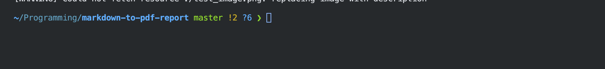

# Note

> because of github markdown preview compatiability, please view this REAMDE.md as raw version

# Definition

Term 1

: Definition
with lazy continuation.

    Paragraph for Term 1 definition.

    { some code, part of definition }

    - bullet 1
    - bullet 2

# Latex Equations

```latex
$$
\text{median} = \begin{cases}
x_{(n+1)/2} & \text{if } n \text{ is odd} \\
\frac{1}{2} (x_{n/2} + x_{n/2+1}) & \text{if } n \text{ is even}
\end{cases}
$$
```

$$
\text{median} = \begin{cases}
x_{(n+1)/2} & \text{if } n \text{ is odd} \\
\frac{1}{2} (x_{n/2} + x_{n/2+1}) & \text{if } n \text{ is even}
\end{cases}
$$

# Example

## examples with (@)

(@) My first example will be numbered (1).
(@) My second example will be numbered (2).

Some text between examples.

(@) My third example will be numbered (3).

## examples with (\@foo)

(@foo) My first example will be numbered (4).

As you can see, in the (@foo) examples, the numbering is continuous. You can also refer to them like this: (\@foo).

# list division

You can divide lists (reset ordering number and line spacing) by adding an empty line between them:

```markdown
1.  one
2.  two
3.  three

<!-- -->

1.  uno
2.  dos
3.  tres
```

upper list will be rendered as:

1.  one
2.  two
3.  three

<!-- -->

1.  uno
2.  dos
3.  tres

# Highlight

You can highlight text by

```markdown
[text to highlight]{.mark}
```

this is rendered as:

[text to highlight]{.mark}

# Small caps

You can use small caps by

```markdown
[small cap text]{.smallcaps}
```

this is rendered as:

[small cap text]{.smallcaps}

# Footnote

You can add a footnote like this:

```markdown
Here is a footnote reference,[^1] and another.[^longnote]

[^1]: Here is the footnote.
[^longnote]: Here's one with multiple blocks.

    Subsequent paragraphs are indented to show that they belong to the previous footnote.
```

this is rendered as:

Here is a footnote reference,[^1] and another.[^longnote]

[^1]: Here is the footnote.
[^longnote]: Here's one with multiple blocks.

    Subsequent paragraphs are indented to show that they belong to the previous footnote.

# Code formatting

You can put line number in the code:

````
```py {.numberLines startFrom="1"}
some code
```

````

this is rendered as:

```c {.numberLines startFrom="1"}
import numpy as np

def f(x):
    return x**2
```

you can also chane the color scheme of highlighting by pandoc option:

```bash {.numberLines startFrom="1"}
--highlight-style=tango
```

compatiable color schemes are:

- pygments
- kate
- monochrome
- espresso
- zenburn
- haddock
- tango
- breezedark
- breezelight

# Image resizing

{width=80%}

```markdown
{width=80%}
```

You can resize the image by adding `{width=value}` after the image link. The value can be in percentage or in pixel.

Here’s a detailed explanation for each component of the metadata you’ve provided for your Pandoc markdown:

## reference using .bib file

You can add references using a `.bib` file. For example, you can add a reference like this:

```markdown
- Some senetence that use reference 1. [@knuth1997art]
- Some senetence that use reference 2. [@website]
```

`bib_file.bib` looks like this:

```bib {.numberLines startFrom="1"}
@book{knuth1997art,
  title={The Art of Computer Programming, Volume 1: Fundamental Algorithms},
  author={Knuth, Donald E.},
  year={1997},
  publisher={Addison-Wesley},
  edition={3rd},
  address={Boston},
}

@article{lamport1986document,
  title={Document preparation system: {L}a{T}e{X}},
  author={Lamport, Leslie},
  journal={Software: Practice and Experience},
  volume={16},
  number={6},
  pages={745--765},
  year={1986},
  publisher={Wiley Online Library}
}

@inproceedings{lecun1998gradient,
  title={Gradient-based learning applied to document recognition},
  author={LeCun, Yann and Bottou, L{\'e}on and Bengio, Yoshua and Haffner, Patrick},
  booktitle={Proceedings of the IEEE},
  volume={86},
  number={11},
  pages={2278--2324},
  year={1998},
  organization={IEEE}
}

@misc{website,
  author = {John Doe},
  title = {An Interesting Article},
  year = {2023},
  url = {http://www.example.com/article},
  note = {Accessed: 2024-10-10}
}
```

This will be rendered as:

- Some senetence that use reference 1. [@knuth1997art]
- Some senetence that use reference 2. [@website]

The references will be listed at the end of the document by using the following code block,
and only the references that are cited in the document will be displayed:

```markdown
:::{#refs}
:::
```

# quote blocks

```
:::info
This is an info block
:::

:::warning
This is a warning block
:::

:::error
This is an error block
:::
```

:::info
This is an info block
:::

:::warning
This is a warning block
:::

:::error
This is an error block
:::

# Spacing / new page

```markdown
\vspace{1em}
\newpage
```

- `\vspace{1em}` adds vertical space equivalent to the height of a lowercase 'm' character.
- `\newpage` forces a page break.

# example reference

:::{#refs}
:::
